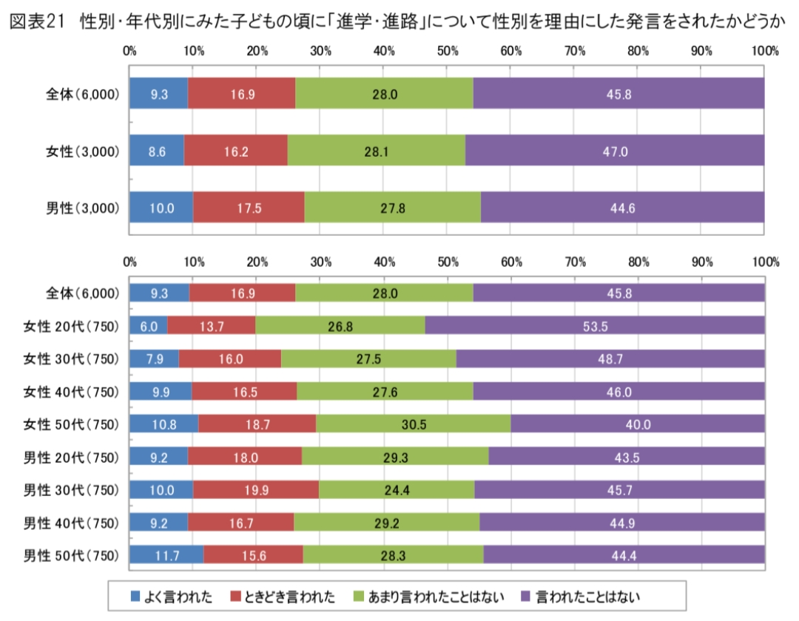

# childhood-gender-bias
Gender-Based Comments on Academic Performance and Career Paths in Childhood: Incidence and Statistical Significance

女性: 6.0%, 13.7%, 26.8%, 53.5% 
男性: 9.2%, 18.0%, 29.3%, 43.5%

[子ども時代の「学業・進路」に関する性別に基づく発言の発生率（回答者の性別・年齢層別）内閣府](https://www.gender.go.jp/research/kenkyu/select_research.html)

上掲グラフの20代へ注目し有意差検定および残差分析を実施した結果、男性は女性と比べ『(進路選択時に)外部から意思干渉を受けた経験がある』と答えた割合が有意に高く、他方『経験なし』と回答する女性が有意に多い傾向を示した。

https://24-blog.github.io/childhood-gender-bias/

このことから、女性よりも「男性の方が」進路選択において意思干渉を受けやすい実態が示唆される。

#### ※画像の著作権は内閣府男女共同参画局に帰属します
